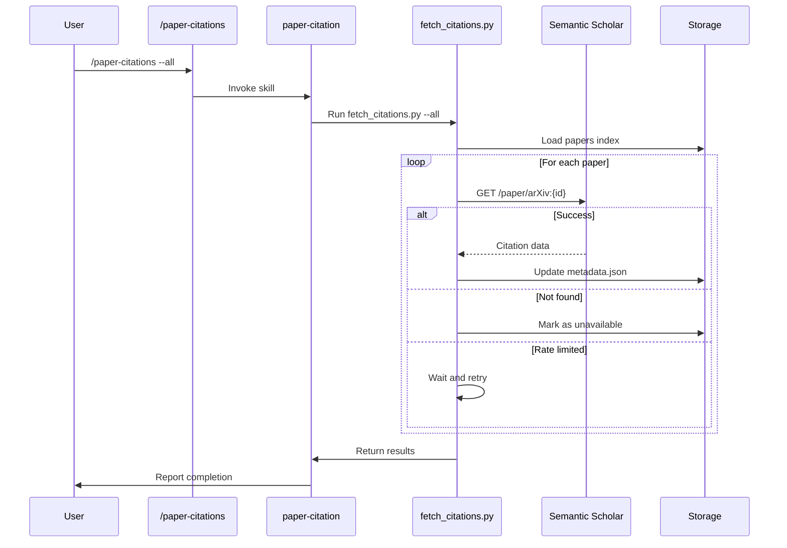
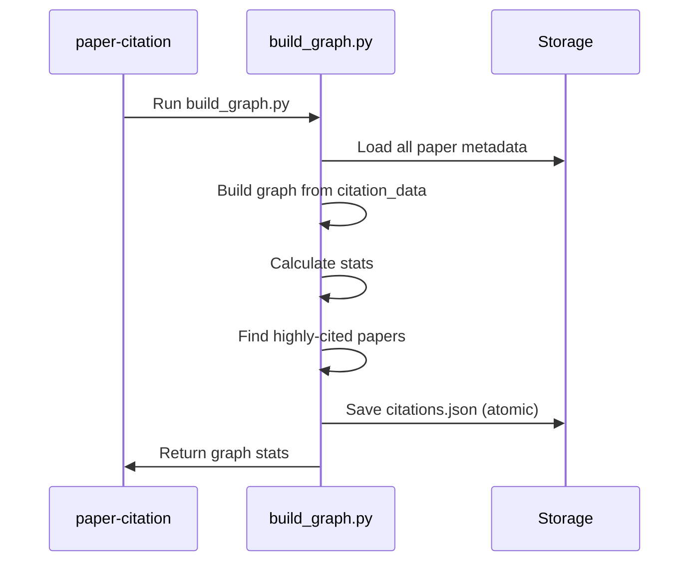

# Design: Citation Graph Feature

**Feature:** F5: Citation Graph
**Priority:** P1
**Date:** 2026-01-27
**Status:** Active

---

## 1. Architecture Overview

The Citation Graph feature adds citation tracking capabilities to the paper-researcher plugin by integrating with the Semantic Scholar API. It follows the established layered architecture pattern.

```
┌─────────────────────────────────────────────────────────────────┐
│                     COMMAND LAYER                               │
│  /paper-researcher:paper-citations                              │
└─────────────────────────────────────────────────────────────────┘
                              ↓
┌─────────────────────────────────────────────────────────────────┐
│                     SKILL LAYER                                 │
│  paper-citation/SKILL.md                                        │
└─────────────────────────────────────────────────────────────────┘
                              ↓
┌─────────────────────────────────────────────────────────────────┐
│                     SCRIPT LAYER                                │
│  fetch_citations.py | build_graph.py                            │
└─────────────────────────────────────────────────────────────────┘
                              ↓
┌─────────────────────────────────────────────────────────────────┐
│                     DATA LAYER                                  │
│  data/index/citations.json | data/papers/*/metadata.json        │
└─────────────────────────────────────────────────────────────────┘
                              ↓
┌─────────────────────────────────────────────────────────────────┐
│                     EXTERNAL LAYER                              │
│  Semantic Scholar API                                           │
└─────────────────────────────────────────────────────────────────┘
```

---

## 2. Component Design

### 2.1 New Files to Create

| File | Purpose |
|------|---------|
| `commands/paper-citations.md` | Command definition for citation operations |
| `skills/paper-citation/SKILL.md` | Skill orchestration for citation workflow |
| `skills/paper-citation/scripts/fetch_citations.py` | Fetch citation data from Semantic Scholar |
| `skills/paper-citation/scripts/build_graph.py` | Build and analyze citation graph |
| `tests/test_fetch_citations.py` | Unit tests for citation fetching |
| `tests/test_build_graph.py` | Unit tests for graph building |
| `tests/fixtures/semantic_scholar_response.json` | Mock API response |

### 2.2 Files to Modify

| File | Changes |
|------|---------|
| `README.md` | Document citation graph feature |

---

## 3. Script Design

### 3.1 fetch_citations.py

**Purpose:** Fetch citation data from Semantic Scholar API for papers in the collection.

**CLI Interface:**
```bash
python fetch_citations.py --paper-id 2401.12345 --data-dir ./data
python fetch_citations.py --all --data-dir ./data
```

**Arguments:**
| Argument | Type | Required | Description |
|----------|------|----------|-------------|
| `--paper-id` | string | No | Single paper arXiv ID |
| `--all` | flag | No | Fetch for all papers |
| `--data-dir` | path | Yes | Data directory path |

**Functions:**
```python
def validate_arxiv_id(paper_id: str) -> bool:
    """Validate arXiv ID format."""

def fetch_with_retry(arxiv_id: str, max_retries: int = 3) -> dict | None:
    """Fetch citation data from Semantic Scholar with retry."""

def extract_arxiv_ids(references: list[dict]) -> list[str]:
    """Extract arXiv IDs from Semantic Scholar references."""

def filter_in_collection(arxiv_ids: list[str], index: dict) -> list[str]:
    """Filter to only papers in our collection."""

def update_metadata(paper_id: str, citation_data: dict, data_dir: Path) -> bool:
    """Update paper metadata with citation data."""

def load_index(data_dir: Path) -> dict:
    """Load papers index."""

def main() -> None:
    """Main entry point."""
```

**Output Format:**
```json
{
  "success": true,
  "papers_processed": 50,
  "papers_with_citations": 45,
  "papers_not_found": 5,
  "errors": []
}
```

### 3.2 build_graph.py

**Purpose:** Build citation graph from metadata and generate index.

**CLI Interface:**
```bash
python build_graph.py --data-dir ./data
python build_graph.py --data-dir ./data --top 10
```

**Arguments:**
| Argument | Type | Required | Description |
|----------|------|----------|-------------|
| `--data-dir` | path | Yes | Data directory path |
| `--top` | int | No | Number of highly-cited papers (default: 10) |

**Functions:**
```python
def validate_arxiv_id(paper_id: str) -> bool:
    """Validate arXiv ID format."""

def load_paper_metadata(paper_id: str, data_dir: Path) -> dict | None:
    """Load metadata for a single paper."""

def build_graph(data_dir: Path) -> dict:
    """Build citation graph from all paper metadata."""

def calculate_stats(graph: dict) -> dict:
    """Calculate graph statistics."""

def get_highly_cited(graph: dict, top_n: int = 10) -> list[str]:
    """Get top N highly-cited papers."""

def save_index(index: dict, data_dir: Path) -> None:
    """Save citations index atomically."""

def main() -> None:
    """Main entry point."""
```

**Output Format:**
```json
{
  "success": true,
  "total_papers": 50,
  "papers_with_citations": 45,
  "total_edges": 150,
  "highly_cited": [
    {"id": "2301.54321", "cited_by_count": 15},
    {"id": "2312.98765", "cited_by_count": 12}
  ]
}
```

---

## 4. API Integration

### 4.1 Semantic Scholar API

**Base URL:** `https://api.semanticscholar.org/graph/v1`

**Endpoint for paper lookup:**
```
GET /paper/arXiv:{arxiv_id}?fields=references,citations,citationCount,referenceCount
```

**Rate Limits:**
- Unauthenticated: 100 requests per 5 minutes
- Delay between requests: 3 seconds (to stay within limits)

**Response Schema:**
```json
{
  "paperId": "abc123",
  "externalIds": {"ArXiv": "2401.12345"},
  "citationCount": 42,
  "referenceCount": 25,
  "references": [
    {"paperId": "def456", "externalIds": {"ArXiv": "2301.54321"}}
  ],
  "citations": [
    {"paperId": "ghi789", "externalIds": {"ArXiv": "2402.11111"}}
  ]
}
```

**Error Handling:**
| Status | Meaning | Action |
|--------|---------|--------|
| 200 | Success | Parse response |
| 404 | Paper not found | Mark as unavailable |
| 429 | Rate limited | Wait and retry |
| 5xx | Server error | Retry with backoff |

---

## 5. Data Model

### 5.1 Extended Paper Metadata

Add `citation_data` field to `data/papers/{id}/metadata.json`:

```json
{
  "id": "2401.12345",
  "title": "Paper Title",
  "authors": ["Author 1"],
  "abstract": "...",
  "published": "2024-01-15",
  "collected_at": "2026-01-27T10:00:00",
  "topics": ["LLM agents"],
  "has_summary": true,
  "categories": ["cs.CL", "cs.AI"],
  "pdf_url": "https://arxiv.org/pdf/2401.12345.pdf",
  "citation_data": {
    "source": "semantic_scholar",
    "fetched_at": "2026-01-27T12:00:00",
    "citation_count": 42,
    "reference_count": 25,
    "references_in_collection": ["2301.54321"],
    "cited_by_in_collection": ["2402.11111"]
  }
}
```

### 5.2 Citations Index

New file: `data/index/citations.json`

```json
{
  "version": "1.0",
  "updated_at": "2026-01-27T12:00:00",
  "graph": {
    "2401.12345": {
      "references": ["2301.54321"],
      "cited_by": ["2402.11111"]
    },
    "2301.54321": {
      "references": [],
      "cited_by": ["2401.12345", "2403.22222"]
    }
  },
  "stats": {
    "total_papers": 50,
    "papers_with_citations": 45,
    "total_edges": 150,
    "highly_cited": ["2301.54321", "2312.98765"]
  }
}
```

---

## 6. Workflow Design

### 6.1 Fetch Citations Workflow



### 6.2 Build Graph Workflow



---

## 7. Error Handling

| Scenario | Handling |
|----------|----------|
| Paper not in Semantic Scholar | Mark `source: "unavailable"`, continue |
| Rate limited (429) | Wait 60 seconds, retry |
| Network error | Retry 3x with exponential backoff |
| Invalid arXiv ID | Skip with warning in logs |
| Corrupted metadata | Skip paper, log error |
| Empty collection | Return success with 0 papers |

---

## 8. Testing Strategy

### 8.1 Unit Tests

**test_fetch_citations.py:**
- `test_validate_arxiv_id()` - ID validation
- `test_fetch_with_retry_success()` - Successful fetch
- `test_fetch_with_retry_not_found()` - 404 handling
- `test_fetch_with_retry_rate_limited()` - 429 handling
- `test_extract_arxiv_ids()` - ID extraction from response
- `test_filter_in_collection()` - Collection filtering
- `test_update_metadata()` - Metadata update
- `test_cli_arguments()` - Argument parsing

**test_build_graph.py:**
- `test_build_graph()` - Graph construction
- `test_calculate_stats()` - Statistics calculation
- `test_get_highly_cited()` - Top papers identification
- `test_save_index_atomic()` - Atomic write
- `test_empty_collection()` - Empty input handling
- `test_cli_arguments()` - Argument parsing

### 8.2 Test Fixtures

**semantic_scholar_response.json:**
```json
{
  "paperId": "abc123",
  "externalIds": {"ArXiv": "2401.1234"},
  "citationCount": 42,
  "referenceCount": 25,
  "references": [
    {"paperId": "def456", "externalIds": {"ArXiv": "2301.5432"}}
  ],
  "citations": [
    {"paperId": "ghi789", "externalIds": {"ArXiv": "2402.1111"}}
  ]
}
```

---

## 9. Command Design

### 9.1 paper-citations.md

```yaml
---
name: paper-citations
description: "Fetch citation data and build citation graph for collected papers."
allowed-tools: Read, Write, Edit, Bash, Skill
---
```

**Arguments:**
- `<paper-id>` (optional): Fetch citations for a specific paper
- `--all` (flag): Fetch citations for all papers in collection

**Examples:**
```
/paper-researcher:paper-citations 2401.12345
/paper-researcher:paper-citations --all
```

---

## 10. Skill Design

### 10.1 paper-citation/SKILL.md

**Workflow:**
1. If `--all` or single paper specified, run `fetch_citations.py`
2. After fetching, run `build_graph.py` to update index
3. Report statistics and highly-cited papers

**Output Format:**
```
Fetched citations for 45/50 papers

Top cited papers in your collection:
1. [2301.54321] "Paper Title" - 15 citations
2. [2312.98765] "Another Paper" - 12 citations
3. [2310.11111] "Third Paper" - 8 citations

Citation graph saved to data/index/citations.json
```

---

## 11. Assumptions and Decisions

1. **Semantic Scholar as primary source:** arXiv API doesn't provide citation data
2. **Unauthenticated access:** No API key required for basic access
3. **3-second delay:** Conservative delay to stay within rate limits
4. **In-collection focus:** Only track citations between papers in our collection
5. **Eager fetching:** Fetch citations when explicitly requested (not auto-fetch on collection)
