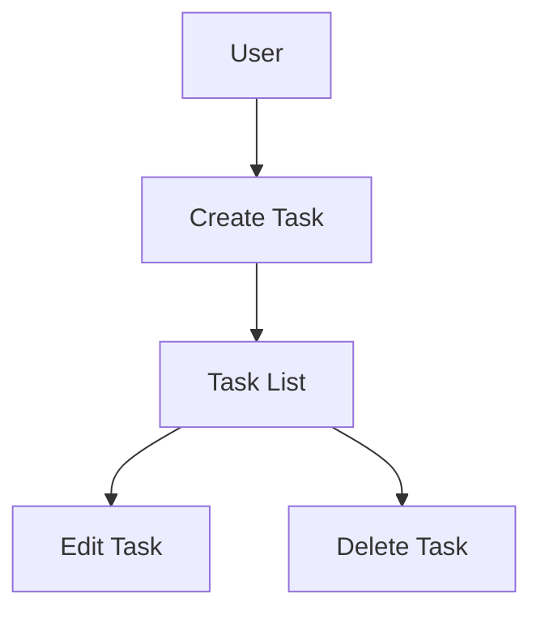

# CLAUDE.md (Project Memory)

## Overview
This document defines standard rules to be followed during development.

## Project Structure

This repository contains the `paper-researcher` Claude Code plugin for automated research paper collection, summarization, and search.

### Document Classification

#### 1. Persistent Documents (`docs/`)

Permanent documents that define "**what to build**" and "**how to build**" for the entire application.
These documents are not updated unless the basic design or policies of the application change.

- **product-requirements.md** - Product Requirements Document
  - Product vision and purpose
  - Target users and their challenges/needs
  - List of main features
  - Definition of success
  - Business requirements
  - User stories
  - Acceptance criteria
  - Functional requirements
  - Non-functional requirements

- **functional-design.md** - Functional Design Document
  - Architecture for each feature
  - System configuration diagram
  - Data model definition (including ER diagrams)
  - Component design
  - Use case diagrams, screen transition diagrams, wireframes
  - API design (for future backend integration)

- **architecture.md** - Technical Specification Document
  - Technology stack
  - Development tools and methodologies
  - Technical constraints and requirements
  - Performance requirements

- **repository-structure.md** - Repository Structure Definition
  - Folder/file structure
  - Directory roles
  - File placement rules

- **development-guidelines.md** - Development Guidelines
  - Coding standards
  - Naming conventions
  - Styling conventions
  - Testing conventions
  - Git conventions

- **glossary.md** - Ubiquitous Language Definition
  - Domain terminology definitions
  - Business terminology definitions
  - UI/UX terminology definitions
  - English-Japanese correspondence table
  - Naming conventions in code


#### 2. Work Unit Documents (`.steering/[YYYYMMDD]-[development-title]/`)

Temporary steering files that define "**what to do this time**" for specific development work.
After work completion, they are retained for reference, but new directories are created for new work.

- **requirements.md** - Requirements for the current work
  - Description of features to be changed/added
  - User stories
  - Acceptance criteria
  - Constraints

- **design.md** - Design of changes
  - Implementation approach
  - Components to be changed
  - Data structure changes
  - Impact analysis

- **tasklist.md** - Task List
  - Specific implementation tasks
  - Task progress status
  - Completion criteria

### Steering Directory Naming Convention

```
.steering/[YYYYMMDD]-[development-title]/
```

**Examples:**
- `.steering/20250103-initial-implementation/`
- `.steering/20250115-add-tag-feature/`
- `.steering/20250120-fix-filter-bug/`
- `.steering/20250201-improve-performance/`

## Development Process

### Initial Setup Procedure

#### 1. Create Folders
```bash
mkdir -p docs
mkdir -p .steering
```

#### 2. Create Persistent Documents (`docs/`)

Define the overall design of the application.
After creating each document, always obtain confirmation and approval before proceeding to the next.

1. `docs/product-requirements.md` - Product Requirements Document
2. `docs/functional-design.md` - Functional Design Document
3. `docs/architecture.md` - Technical Specification Document
4. `docs/repository-structure.md` - Repository Structure Definition
5. `docs/development-guidelines.md` - Development Guidelines
6. `docs/glossary.md` - Ubiquitous Language Definition

**Important:** After creating each file, always obtain confirmation and approval before creating the next file

#### 3. Create Steering Files for Initial Implementation

Create a directory for initial implementation and place the necessary documents.

```bash
mkdir -p .steering/[YYYYMMDD]-initial-implementation
```

Documents to create:
1. `.steering/[YYYYMMDD]-initial-implementation/requirements.md` - Initial implementation requirements
2. `.steering/[YYYYMMDD]-initial-implementation/design.md` - Implementation design
3. `.steering/[YYYYMMDD]-initial-implementation/tasklist.md` - Implementation tasks

#### 4. Environment Setup

#### 5. Start Implementation

Proceed with implementation based on `.steering/[YYYYMMDD]-initial-implementation/tasklist.md`.

#### 6. Quality Check

### Procedure for Adding/Modifying Features

#### 1. Impact Analysis

- Check the impact on persistent documents (`docs/`)
- If changes affect the basic design, update `docs/`

#### 2. Create Steering Directory

Create a directory for the new work.

```bash
mkdir -p .steering/[YYYYMMDD]-[development-title]
```

**Example:**
```bash
mkdir -p .steering/20250115-add-tag-feature
```

#### 3. Create Work Documents

Create work unit documents.
After creating each document, always obtain confirmation and approval before proceeding to the next.

1. `.steering/[YYYYMMDD]-[development-title]/requirements.md` - Requirements
2. `.steering/[YYYYMMDD]-[development-title]/design.md` - Design
3. `.steering/[YYYYMMDD]-[development-title]/tasklist.md` - Task List

**Important:** After creating each file, always obtain confirmation and approval before creating the next file

#### 4. Update Persistent Documents (only if necessary)

If changes affect the basic design, update the relevant documents in `docs/`.

#### 5. Start Implementation

Proceed with implementation based on `.steering/[YYYYMMDD]-[development-title]/tasklist.md`.

#### 6. Quality Check

## Document Management Principles

### Persistent Documents (`docs/`)
- Describe the basic design of the application
- Not frequently updated
- Updated only during major design changes
- Function as the "North Star" for the entire project

### Work Unit Documents (`.steering/`)
- Specialized for specific work/changes
- Create a new directory for each work
- Retained as history after work completion
- Record the intent and background of changes

## Task Management vs Steering Documents

**Important:** Understand the distinction between Claude Code task management and steering documents.

### Claude Code Task Management (Like Jira Board)
- Manages the **list of all tasks** to be completed across the project
- Each task is equivalent to a **Jira ticket** - a discrete unit of work
- Use `TaskCreate`, `TaskList`, `TaskUpdate`, and `TaskGet` tools to manage tasks
- Tracks **which tasks exist**, **who owns them**, and **their completion status**
- Provides a high-level view of all work items in the project

### Steering Documents (Like Details Within One Jira Ticket)
- Tracks the **progress and status within a single task**
- `.steering/[YYYYMMDD]-[development-title]/tasklist.md` contains:
  - Detailed implementation steps for that specific work
  - Granular progress tracking within the task
  - Checkboxes and status indicators for sub-tasks
- Think of it as the **"description" and "subtasks" section** of a Jira ticket
- Provides context, requirements, design decisions, and implementation plan for one piece of work

### Example Workflow
```
Claude Code Tasks (Jira Board):
├── Task 1: Add user authentication     [in_progress] ← Current focus
├── Task 2: Implement dashboard         [pending]
├── Task 3: Add notification system     [pending]
└── Task 4: Write API documentation     [pending]

Steering for Task 1 (.steering/20250125-add-authentication/):
├── requirements.md  ← What needs to be built
├── design.md        ← How it will be built
└── tasklist.md      ← Granular steps within this task
    ├── [x] Set up auth provider
    ├── [x] Create login component
    ├── [ ] Implement session management  ← Current step
    ├── [ ] Add password reset flow
    └── [ ] Write tests
```

**Rule:** Use Claude Code task management to track **what work exists**. Use steering documents to track **how to complete each piece of work**.

## Rules for Diagrams and Charts

### Placement Location
Design diagrams and charts are written directly within the relevant persistent documents.
Do not create a separate diagrams folder to minimize effort.

**Placement Examples:**
- ER diagrams, data model diagrams → Within `functional-design.md`
- Use case diagrams → Within `functional-design.md` or `product-requirements.md`
- Screen transition diagrams, wireframes → Within `functional-design.md`
- System configuration diagrams → Within `functional-design.md` or `architecture.md`

### Notation Format
1. **Mermaid Notation (Recommended)**
   - Can be embedded directly in Markdown
   - Easy version control
   - Editable without special tools



2. **ASCII Art**
   - Used for simple diagrams
   - Editable with text editors

```
┌─────────────┐
│   Header    │
└─────────────┘
       │
       ↓
┌─────────────┐
│  Task List  │
└─────────────┘
```

3. **Image Files (only when necessary)**
   - Complex wireframes or mockups
   - Place in `docs/images/` folder
   - PNG or SVG format recommended

### Updating Diagrams
- Update corresponding diagrams simultaneously with design changes
- Prevent discrepancies between diagrams and code

## Notes

- Create and update documents incrementally, obtaining approval at each stage
- Make `.steering/` directory names clearly identifiable with date and development title
- Do not confuse persistent documents with work unit documents
- Always run lint and type checking after code changes
- Use a common design system (Tailwind CSS) to maintain consistency
- Security-conscious coding (XSS prevention, input validation, etc.)
- Keep diagrams to a minimum to reduce maintenance costs
