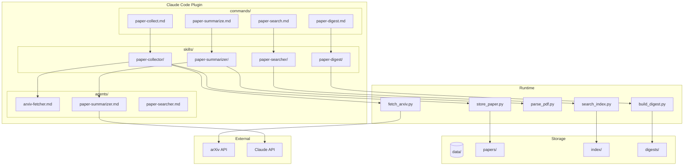

# Architecture Design Document: Paper Researcher Plugin

**Version:** 1.0
**Date:** 2026-01-27
**Status:** Draft

---

## 1. Overview

This document defines the technical architecture, technology stack, design decisions, and implementation guidelines for the Paper Researcher Claude Code plugin.

---

## 2. Architecture Principles

### 2.1 Design Goals

| Goal | Description |
|------|-------------|
| **Simplicity** | Minimal dependencies, straightforward implementation |
| **Extensibility** | Plugin architecture for adding new paper sources |
| **Reliability** | Graceful error handling, retry logic for API calls |
| **Performance** | Local caching, efficient search indexing |
| **Portability** | Standard Python, no complex infrastructure |

### 2.2 Architectural Decisions

| Decision | Rationale | Alternatives Considered |
|----------|-----------|------------------------|
| **Claude Code Plugin** | Native integration with Claude CLI, standardized structure | Standalone CLI tool, VS Code extension |
| **Local File Storage** | Simple, no database setup, git-friendly (when desired) | SQLite, PostgreSQL, cloud storage |
| **Python Scripts** | Best ecosystem for arXiv API, PDF parsing | TypeScript, Go, Rust |
| **JSON + Markdown** | Human-readable, easy to debug, version-controllable | Binary formats, database records |
| **arXiv First** | Most accessible API, comprehensive CS/ML coverage | Semantic Scholar, Google Scholar |

---

## 3. System Architecture

### 3.1 Layer Architecture

```
┌─────────────────────────────────────────────────────────────────┐
│                     PRESENTATION LAYER                          │
│  User ←→ Claude Code CLI ←→ Slash Commands                      │
└─────────────────────────────────────────────────────────────────┘
                              ↓
┌─────────────────────────────────────────────────────────────────┐
│                     ORCHESTRATION LAYER                         │
│  Commands → Skills → Agents                                     │
│  (Markdown definitions with YAML frontmatter)                   │
└─────────────────────────────────────────────────────────────────┘
                              ↓
┌─────────────────────────────────────────────────────────────────┐
│                     EXECUTION LAYER                             │
│  Python Scripts (called via Bash tool)                          │
│  fetch_arxiv.py | store_paper.py | search_index.py              │
└─────────────────────────────────────────────────────────────────┘
                              ↓
┌─────────────────────────────────────────────────────────────────┐
│                     DATA LAYER                                  │
│  Local Filesystem: data/papers/, data/index/, data/digests/     │
└─────────────────────────────────────────────────────────────────┘
                              ↓
┌─────────────────────────────────────────────────────────────────┐
│                     EXTERNAL LAYER                              │
│  arXiv API | Claude API (via Claude Code)                       │
└─────────────────────────────────────────────────────────────────┘
```

### 3.2 Component Diagram



---

## 4. Technology Stack

### 4.1 Core Technologies

| Layer | Technology | Version | Purpose |
|-------|------------|---------|---------|
| Runtime | Python | 3.10+ | Script execution |
| HTTP Client | requests | 2.28+ | API calls |
| XML Parsing | feedparser | 6.0+ | arXiv Atom feed parsing |
| PDF Parsing | pypdf | 3.0+ | PDF text extraction |
| JSON | stdlib | - | Data serialization |

### 4.2 Development Tools

| Tool | Purpose |
|------|---------|
| uv | Python package management |
| ruff | Linting and formatting |
| mypy | Type checking |
| pytest | Testing |

### 4.3 Claude Code Plugin Structure

```
paper-researcher/
├── .claude-plugin/
│   └── plugin.json
├── agents/
│   ├── arxiv-fetcher.md
│   ├── paper-summarizer.md
│   └── paper-searcher.md
├── commands/
│   ├── paper-collect.md
│   ├── paper-search.md
│   ├── paper-summarize.md
│   └── paper-digest.md
├── skills/
│   ├── paper-collector/
│   │   ├── SKILL.md
│   │   └── scripts/
│   │       ├── fetch_arxiv.py
│   │       └── store_paper.py
│   ├── paper-summarizer/
│   │   ├── SKILL.md
│   │   └── scripts/
│   │       └── parse_pdf.py
│   ├── paper-searcher/
│   │   ├── SKILL.md
│   │   └── scripts/
│   │       └── search_index.py
│   └── paper-digest/
│       ├── SKILL.md
│       └── scripts/
│           └── build_digest.py
├── data/                       # Runtime data (gitignored)
│   ├── papers/
│   ├── index/
│   └── digests/
├── tests/
│   └── ...
├── pyproject.toml
├── README.md
└── .gitignore
```

---

## 5. Data Architecture

### 5.1 Storage Strategy

| Data Type | Format | Location | Retention |
|-----------|--------|----------|-----------|
| Paper Metadata | JSON | `data/papers/{id}/metadata.json` | Permanent |
| Paper Summary | Markdown | `data/papers/{id}/summary.md` | Permanent |
| Paper PDF | PDF | `data/papers/{id}/paper.pdf` | Optional |
| Search Index | JSON | `data/index/papers.json` | Rebuilt on collection |
| Topic Index | JSON | `data/index/topics.json` | Rebuilt on collection |
| Digests | Markdown | `data/digests/{date}.md` | Permanent |

### 5.2 Index Schema

**papers.json:**
```json
{
  "version": "1.0",
  "updated_at": "2026-01-27T10:00:00Z",
  "papers": {
    "2401.12345": {
      "title": "Paper Title",
      "authors": ["Author 1"],
      "abstract": "...",
      "topics": ["LLM agents"],
      "collected_at": "2026-01-27T10:00:00Z",
      "has_summary": true
    }
  }
}
```

**topics.json:**
```json
{
  "version": "1.0",
  "topics": {
    "LLM agents": ["2401.12345", "2401.12346"],
    "transformers": ["2401.12347"]
  }
}
```

### 5.3 File Naming Conventions

| Entity | Pattern | Example |
|--------|---------|---------|
| Paper Directory | `{arxiv_id}` | `2401.12345/` |
| Digest File | `{YYYY-MM-DD}.md` | `2026-01-27.md` |
| Index File | `{type}.json` | `papers.json`, `topics.json` |

---

## 6. API Design

### 6.1 arXiv API Integration

**Client Configuration:**
```python
ARXIV_BASE_URL = "http://export.arxiv.org/api/query"
MAX_RESULTS = 50
REQUEST_DELAY = 3.0  # seconds between requests
MAX_RETRIES = 3
BACKOFF_FACTOR = 2  # exponential backoff multiplier
```

**Retry Strategy:**
```python
def fetch_with_retry(query: str, max_results: int = 50) -> list:
    for attempt in range(MAX_RETRIES):
        try:
            response = requests.get(
                ARXIV_BASE_URL,
                params={"search_query": query, "max_results": max_results}
            )
            response.raise_for_status()
            return parse_response(response.text)
        except requests.RequestException:
            if attempt < MAX_RETRIES - 1:
                delay = REQUEST_DELAY * (BACKOFF_FACTOR ** attempt)
                time.sleep(delay)
            else:
                raise
```

### 6.2 Script Interfaces

**fetch_arxiv.py:**
```bash
python fetch_arxiv.py --query "LLM agents" --days 7 --max 50 --output papers.json
```

**store_paper.py:**
```bash
python store_paper.py --input papers.json --data-dir ./data
```

**search_index.py:**
```bash
python search_index.py --query "attention" --data-dir ./data --limit 10
```

**build_digest.py:**
```bash
python build_digest.py --since 7d --data-dir ./data --output data/digests/2026-01-27.md
```

**parse_pdf.py:**
```bash
python parse_pdf.py --pdf path/to/paper.pdf --output text.md
```

---

## 7. Error Handling

### 7.1 Error Categories

| Category | Examples | Handling Strategy |
|----------|----------|-------------------|
| **Network Errors** | Connection timeout, DNS failure | Retry with backoff |
| **API Errors** | 503 Service Unavailable, 429 Rate Limited | Retry with longer backoff |
| **Data Errors** | Invalid JSON, missing fields | Log error, skip item, continue |
| **File Errors** | Permission denied, disk full | Report to user, abort operation |
| **User Errors** | Invalid query, bad paper ID | Return friendly error message |

### 7.2 Error Response Format

```json
{
  "success": false,
  "error": {
    "code": "ARXIV_API_UNAVAILABLE",
    "message": "Failed to fetch papers after 3 retries",
    "details": "503 Service Temporarily Unavailable"
  }
}
```

---

## 8. Performance Considerations

### 8.1 Performance Targets

| Operation | Target | Strategy |
|-----------|--------|----------|
| Collect 50 papers | < 60s | Parallel metadata fetch (with rate limiting) |
| Generate summary | < 5s | Single API call per paper |
| Search papers | < 2s | In-memory index search |
| Build digest | < 10s | Stream processing |

### 8.2 Optimization Strategies

| Strategy | Description |
|----------|-------------|
| **Index Caching** | Load index once, reuse for multiple searches |
| **Lazy PDF Download** | Only download PDF when explicitly requested |
| **Incremental Collection** | Skip papers already in collection |
| **Batch Summarization** | Process multiple papers in sequence |

---

## 9. Security Considerations

### 9.1 Data Security

| Concern | Mitigation |
|---------|------------|
| Local data exposure | Store in project directory, add to .gitignore |
| API key exposure | Claude API accessed via Claude Code (no separate key) |
| Malicious PDF | Use trusted pypdf library, don't execute PDF content |

### 9.2 Input Validation

```python
def validate_arxiv_id(paper_id: str) -> bool:
    """Validate arXiv ID format: YYMM.NNNNN or YYMM.NNNN"""
    return bool(re.match(r"^\d{4}\.\d{4,5}$", paper_id))

def validate_query(query: str) -> bool:
    """Validate search query - no SQL/command injection"""
    return len(query) < 500 and not re.search(r"[;<>&|]", query)
```

---

## 10. Extensibility

### 10.1 Plugin Architecture for Paper Sources

New paper sources can be added by implementing a source plugin:

```python
class PaperSource(ABC):
    """Abstract base class for paper sources."""

    @abstractmethod
    def search(self, query: str, days: int, max_results: int) -> list[Paper]:
        """Search for papers matching the query."""
        pass

    @abstractmethod
    def fetch_metadata(self, paper_id: str) -> Paper:
        """Fetch metadata for a specific paper."""
        pass

    @abstractmethod
    def download_pdf(self, paper_id: str, output_path: str) -> bool:
        """Download PDF for a paper. Returns success status."""
        pass
```

### 10.2 Planned Source Plugins

| Source | Priority | Notes |
|--------|----------|-------|
| arXiv | P0 (MVP) | Reference implementation |
| Local PDF | P1 | Manual upload support |
| Semantic Scholar | P1 | Citation data, broader coverage |
| Conference sites | P2 | Web scraping |
| Google Scholar | P2 | Complex, may need alternative |

---

## 11. Testing Strategy

### 11.1 Test Categories

| Category | Coverage | Tools |
|----------|----------|-------|
| Unit Tests | Script functions, parsers | pytest |
| Integration Tests | API calls (mocked), file operations | pytest, responses |
| E2E Tests | Full command workflows | pytest, subprocess |

### 11.2 Test Data

- Mock arXiv API responses stored in `tests/fixtures/`
- Sample PDFs for parsing tests
- Sample paper directories for search tests

---

## 12. Deployment

### 12.1 Installation

```bash
# Clone plugin repository
git clone <plugin-repo-url> paper-researcher

# Install Python dependencies
cd paper-researcher
uv sync

# Register with Claude Code
claude plugin install ./paper-researcher
```

### 12.2 Configuration

**Environment Variables:**
| Variable | Default | Description |
|----------|---------|-------------|
| `PAPER_DATA_DIR` | `./data` | Data storage directory |
| `ARXIV_MAX_RESULTS` | `50` | Default max papers per request |
| `ARXIV_REQUEST_DELAY` | `3.0` | Seconds between API requests |

---

## 13. Monitoring and Logging

### 13.1 Logging Strategy

| Level | Usage |
|-------|-------|
| DEBUG | API request/response details |
| INFO | Operation progress (papers collected, summaries generated) |
| WARNING | Recoverable errors (PDF download failed, retry attempted) |
| ERROR | Unrecoverable errors (API unavailable after retries) |

### 13.2 Log Format

```
2026-01-27 10:00:00 INFO [fetch_arxiv] Querying arXiv for "LLM agents" (last 7 days)
2026-01-27 10:00:03 INFO [fetch_arxiv] Found 12 papers
2026-01-27 10:00:05 WARNING [store_paper] Duplicate paper 2401.12345, skipping
2026-01-27 10:00:10 INFO [paper-collector] Collection complete: 11 new papers
```

---

## 14. Clarifications

### Session 2026-01-27

*No architecture clarifications needed - proceeding with defaults based on PRD and Functional Design.*

---

## 15. References

- [arXiv API Documentation](https://info.arxiv.org/help/api/index.html)
- [Claude Code Plugin Documentation](https://docs.anthropic.com/claude-code)
- [pypdf Documentation](https://pypdf.readthedocs.io/)
- [feedparser Documentation](https://feedparser.readthedocs.io/)
