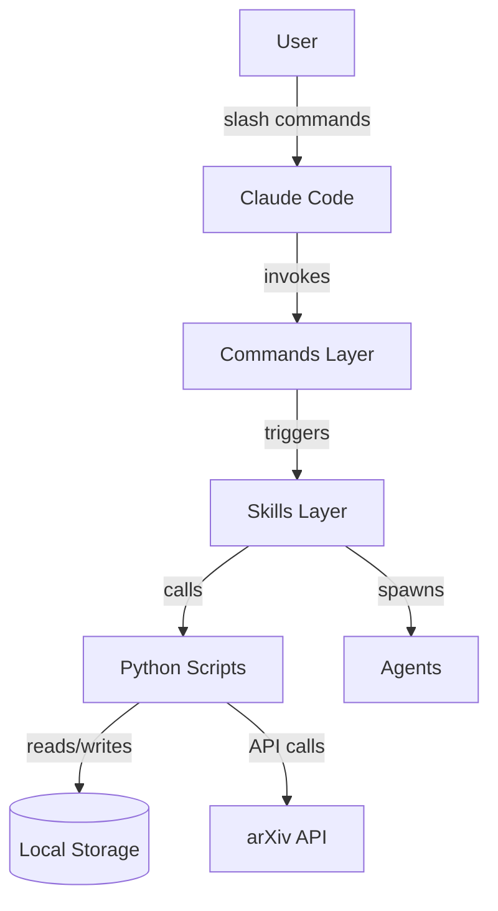
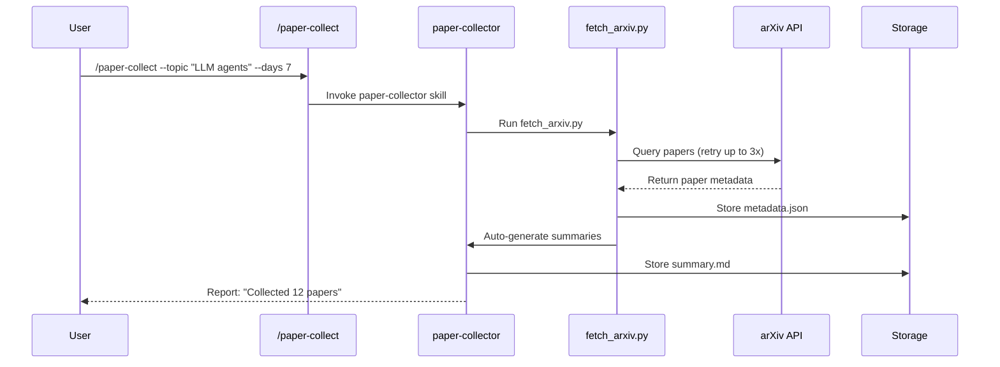
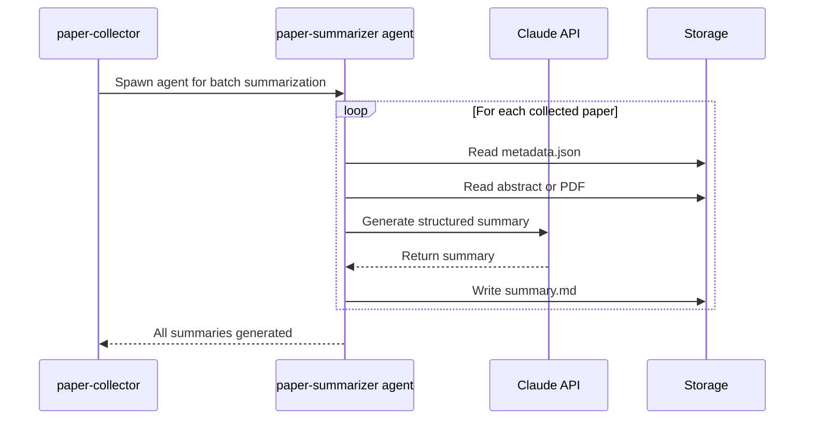
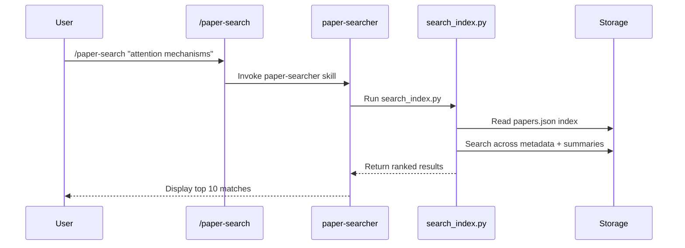
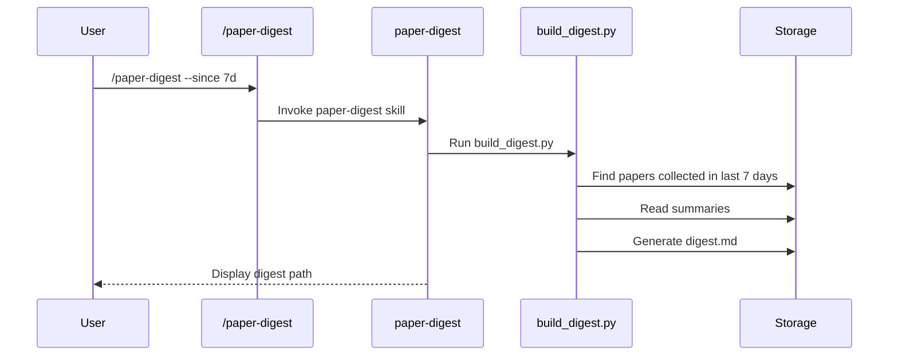
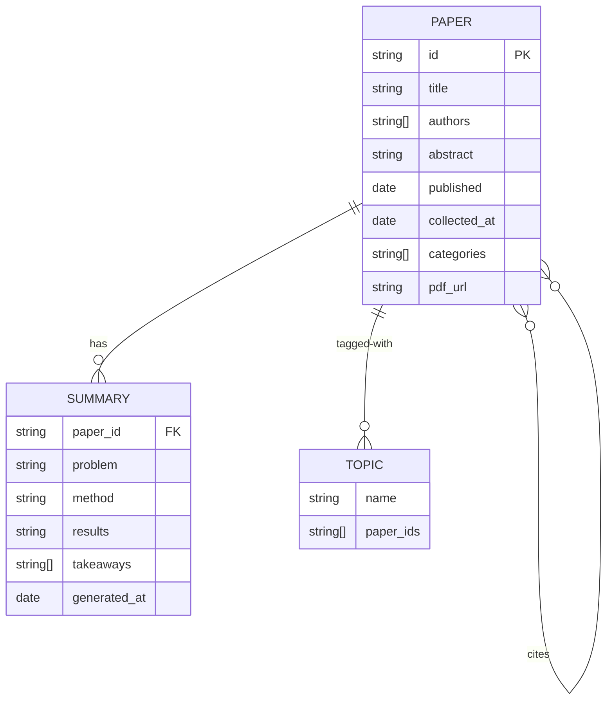

# Functional Design Document: Paper Researcher Plugin

**Version:** 1.0
**Date:** 2026-01-27
**Status:** Draft

---

## 1. Overview

This document defines the functional architecture, user workflows, data model, and component design for the Paper Researcher Claude Code plugin.

---

## 2. System Architecture

### 2.1 High-Level Architecture



### 2.2 Component Layers

| Layer | Responsibility | Technology |
|-------|----------------|------------|
| **Commands** | Entry points for user interaction | Markdown with YAML frontmatter |
| **Skills** | Workflow orchestration and instructions | SKILL.md + bundled scripts |
| **Agents** | Specialized autonomous workers | Agent markdown definitions |
| **Scripts** | Deterministic data operations | Python 3.10+ |
| **Storage** | Paper metadata and summaries | Local filesystem (JSON + Markdown) |

---

## 3. User Workflows

### 3.1 Workflow: Collect Papers



**Steps:**
1. User runs `/paper-collect` command with topic and date range
2. Command invokes `paper-collector` skill
3. Skill executes `fetch_arxiv.py` script
4. Script queries arXiv API (max 50 results)
5. On failure, retry with exponential backoff (3 attempts)
6. Store each paper's metadata in `data/papers/{id}/metadata.json`
7. Auto-generate summaries for all collected papers
8. Report count and list of collected papers

### 3.2 Workflow: Summarize Papers



**Steps:**
1. After paper collection, spawn `paper-summarizer` agent
2. For each paper in batch:
   - Read paper metadata
   - Extract abstract (or parse PDF if available)
   - Send to Claude API with structured prompt
   - Receive summary in format: title, problem, method, results, takeaways
   - Save as `summary.md` in paper directory
3. Mark papers as summarized in index

### 3.3 Workflow: Search Papers



**Steps:**
1. User runs `/paper-search` with query
2. Skill executes `search_index.py`
3. Script loads paper index
4. Perform keyword/semantic search across:
   - Paper titles
   - Abstracts
   - Summary content
5. Rank results by relevance
6. Return top 10 matches with excerpts

### 3.4 Workflow: Generate Digest



---

## 4. Data Model

### 4.1 Entity-Relationship Diagram



### 4.2 Data Schemas

#### Paper Metadata Schema

```json
{
  "$schema": "http://json-schema.org/draft-07/schema#",
  "type": "object",
  "required": ["id", "title", "authors", "abstract", "published"],
  "properties": {
    "id": {
      "type": "string",
      "pattern": "^\\d{4}\\.\\d{4,5}$",
      "description": "arXiv ID (e.g., 2401.12345)"
    },
    "title": {
      "type": "string",
      "minLength": 1
    },
    "authors": {
      "type": "array",
      "items": {"type": "string"},
      "minItems": 1
    },
    "abstract": {
      "type": "string"
    },
    "published": {
      "type": "string",
      "format": "date"
    },
    "updated": {
      "type": "string",
      "format": "date"
    },
    "categories": {
      "type": "array",
      "items": {"type": "string"}
    },
    "pdf_url": {
      "type": "string",
      "format": "uri"
    },
    "collected_at": {
      "type": "string",
      "format": "date-time"
    },
    "topics": {
      "type": "array",
      "items": {"type": "string"}
    },
    "has_summary": {
      "type": "boolean",
      "default": false
    }
  }
}
```

#### Summary Schema (Markdown Structure)

```markdown
# [Paper Title]

**Authors:** [Author list]
**arXiv:** [ID] | **Published:** [Date]

## Problem
[1-2 sentences]

## Method
[2-3 sentences]

## Results
[Key findings]

## Takeaways
- [Point 1]
- [Point 2]
- [Point 3]
```

### 4.3 File System Structure

```
data/                           # Excluded from git
├── papers/                     # Individual paper directories
│   ├── 2401.12345/
│   │   ├── metadata.json       # Paper metadata (required)
│   │   ├── summary.md          # Generated summary (required)
│   │   └── paper.pdf           # Original PDF (optional)
│   └── 2401.12346/
│       └── ...
├── index/                      # Search index
│   ├── papers.json             # Global paper index
│   └── topics.json             # Topic → paper mappings
└── digests/                    # Generated digests
    ├── 2026-01-27.md
    └── 2026-02-03.md
```

---

## 5. Component Design

### 5.1 Commands

#### paper-collect.md

```yaml
---
name: paper-collect
description: "Fetch new papers from arXiv based on topics/keywords and store locally."
allowed-tools: Read, Write, Edit, Bash, Task, Skill
---
```

**Arguments:**
- `--topic <string>` (required): Search query
- `--days <int>` (optional, default=7): Days to look back
- `--max <int>` (optional, default=50): Max papers to collect

**Behavior:**
- Invoke `paper-collector` skill
- Pass arguments to skill
- Display collection results

#### paper-search.md

```yaml
---
name: paper-search
description: "Search collected papers by keyword or natural language query."
allowed-tools: Read, Bash, Skill
---
```

**Arguments:**
- `<query>` (required): Search query

**Behavior:**
- Invoke `paper-searcher` skill
- Display ranked results with excerpts

#### paper-summarize.md

```yaml
---
name: paper-summarize
description: "Generate or regenerate summary for a specific paper."
allowed-tools: Read, Write, Bash, Task, Skill
---
```

**Arguments:**
- `<paper-id>` (required): arXiv ID

**Behavior:**
- Invoke `paper-summarizer` skill for single paper
- Display summary when complete

#### paper-digest.md

```yaml
---
name: paper-digest
description: "Generate digest of recently collected papers."
allowed-tools: Read, Write, Bash, Skill
---
```

**Arguments:**
- `--since <timespan>` (optional, default=7d): Time range

**Behavior:**
- Invoke `paper-digest` skill
- Display digest markdown

### 5.2 Skills

#### paper-collector

**Purpose:** Fetch papers from arXiv and auto-generate summaries.

**Bundled Scripts:**
- `fetch_arxiv.py` - Query arXiv API, download metadata
- `store_paper.py` - Save metadata to filesystem

**Workflow:**
1. Run `fetch_arxiv.py --query "<topic>" --days <N> --max 50`
2. Script outputs `papers.json` with metadata
3. Run `store_paper.py --input papers.json`
4. Spawn `paper-summarizer` agent for batch summarization
5. Report completion

#### paper-summarizer

**Purpose:** Generate structured summaries using Claude API.

**Bundled Scripts:**
- `parse_pdf.py` - Extract text from PDF (if available)

**Workflow:**
1. Read paper metadata
2. Extract abstract or parse PDF
3. Call Claude API with structured prompt
4. Save summary as markdown
5. Update metadata with `has_summary: true`

#### paper-searcher

**Purpose:** Search across collected papers.

**Bundled Scripts:**
- `search_index.py` - Build/query search index

**Workflow:**
1. Load `data/index/papers.json`
2. Perform keyword matching across title/abstract/summary
3. Rank by relevance score
4. Return top N results

#### paper-digest

**Purpose:** Generate weekly/daily digests.

**Bundled Scripts:**
- `build_digest.py` - Aggregate papers into digest

**Workflow:**
1. Filter papers by collection date
2. Group by topic
3. Generate markdown digest
4. Save to `data/digests/`

### 5.3 Agents

#### arxiv-fetcher

**Purpose:** Handle arXiv API integration with retry logic.

**Responsibilities:**
- Query arXiv API
- Implement exponential backoff retry (3 attempts)
- Parse API responses
- Download PDFs (optional)

#### paper-summarizer

**Purpose:** Batch summarization of collected papers.

**Responsibilities:**
- Read paper metadata
- Call Claude API for each paper
- Use structured summary prompt
- Save summaries in parallel (if possible)

#### paper-searcher

**Purpose:** Semantic search across papers.

**Responsibilities:**
- Build search index
- Execute queries
- Rank results

---

## 6. API Integrations

### 6.1 arXiv API

**Endpoint:** `http://export.arxiv.org/api/query`

**Query Parameters:**
- `search_query`: Query string (e.g., `cat:cs.CL AND ti:agents`)
- `start`: Result offset
- `max_results`: Max results (limit: 50)
- `sortBy`: `submittedDate` or `lastUpdatedDate`
- `sortOrder`: `descending`

**Rate Limits:**
- Max 1 request per 3 seconds
- Implement backoff if 503 returned

**Error Handling:**
- 503 Service Unavailable → Retry with exponential backoff
- 400 Bad Request → Report invalid query to user
- Network timeout → Retry up to 3 times

### 6.2 Claude API

**Usage:** Summary generation via Claude Code's built-in access.

**Prompt Template:**
```
Summarize this academic paper in the following structured format:

Title: [paper title]
Authors: [authors]

## Problem
[1-2 sentences describing what problem this paper addresses]

## Method
[2-3 sentences describing the approach taken]

## Results
[Key findings and metrics]

## Takeaways
[3-5 actionable bullet points]

Paper:
[paper abstract or full text]
```

---

## 7. Error States and Edge Cases

### 7.1 Error Scenarios

| Scenario | User Experience | System Behavior |
|----------|-----------------|-----------------|
| arXiv API unavailable | "Failed to fetch papers after 3 retries. Try again later." | Retry with backoff, then fail gracefully |
| No papers match query | "No papers found for '<query>' in the last 7 days." | Return empty result set |
| PDF download fails | Summary generated from abstract only | Skip PDF, use abstract text |
| Duplicate paper collected | Paper skipped | Check index before storing |
| Summary generation fails | "Failed to summarize paper [ID]" | Mark as unsummarized, allow retry |
| Invalid paper ID for search | "Paper [ID] not found in collection" | Return error message |

### 7.2 Empty States

| State | Display |
|-------|---------|
| No papers collected | "No papers in collection. Run `/paper-collect` to get started." |
| No search results | "No matching papers found for '<query>'. Try different keywords." |
| No papers for digest | "No papers collected in the specified timeframe." |

---

## 8. Performance Requirements

| Operation | Target | Measurement |
|-----------|--------|-------------|
| Collect 50 papers | < 60 seconds | Time from command to completion |
| Generate 1 summary | < 5 seconds | Time per paper summary |
| Search papers | < 2 seconds | Time to return results |
| Build digest | < 10 seconds | Time to generate digest for 50 papers |

---

## 9. Security and Privacy

### 9.1 Data Privacy
- All data stored locally (not transmitted to external services except arXiv/Claude)
- No user authentication required
- No data shared between users

### 9.2 Input Validation
- Validate arXiv paper IDs (format: `\d{4}\.\d{4,5}`)
- Sanitize search queries to prevent injection
- Validate date ranges and max results parameters

---

## 10. Future Enhancements (P1/P2)

### 10.1 Citation Graph (P1)
- Extract citation data from papers
- Build graph visualization
- Identify highly-cited papers

### 10.2 Semantic Scholar Integration (P1)
- Add Semantic Scholar as paper source
- Enrich metadata with citation counts
- Cross-reference with arXiv

### 10.3 Export Integrations (P2)
- Notion export
- Obsidian vault integration
- PDF annotation export

---

## 11. Clarifications

### Session 2026-01-27

*No functional design clarifications needed - proceeding with defaults based on PRD.*

---

## 12. Appendix

### 12.1 arXiv Category Codes

Common categories for filtering:
- `cs.CL` - Computation and Language
- `cs.AI` - Artificial Intelligence
- `cs.LG` - Machine Learning
- `cs.CV` - Computer Vision
- `stat.ML` - Machine Learning (Statistics)

### 12.2 Sample Search Queries

| User Intent | arXiv Query |
|-------------|-------------|
| "LLM agents" | `cat:cs.CL AND (ti:agent OR abs:agent)` |
| "Transformer models" | `cat:cs.CL AND (ti:transformer OR abs:transformer)` |
| "Vision transformers" | `cat:cs.CV AND ti:transformer` |
